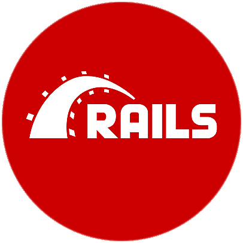

# Hie! :wave::smiley: My Name is Helix!

I'm a Software Engineer and Fullstack Web Developer from Blantyre, Malawi :earth_africa:   
:mega: Are you hiring? Or like to work with me? you can write to me on LinkedIn (link is on my profile) or <a href="mailto:wonganichipofya98@gmail.com">email me.</a>
  
 :mega: Also click on my <a href="https://helixmw.github.io" target="blank">portfolio link</a> for more!

 Languages and Frameworks:  
  &nbsp;
 &nbsp;
 &nbsp;
  &nbsp;
 &nbsp;
 &nbsp;
 &nbsp;
 &nbsp;
 &nbsp;
 &nbsp;
 &nbsp;

 Databases and Frameworks:
  
  
  &nbsp;
  &nbsp;
  &nbsp;
  &nbsp;
  &nbsp;

  Development Tools:
   
   
  &nbsp;
  &nbsp;
  &nbsp;
  
  
  
 
 <!-- Add-ons I have tested with Vue.js:
  
  
   &nbsp;
     &nbsp; -->

  

  
 
 
 

